# Shiftly User Guide

**Audience:** Administrators, Supervisors, and Employees  
**Application:** Employee Shift Planner (Shiftly)  
**Guide version:** 1.1 — October 6, 2026

> The screenshots in this guide use fictional demonstration data. Menus and actions vary by role.

## 1. What Shiftly does

Shiftly helps a team create weekly schedules, manage employees and availability, review leave and shift-swap requests, track attendance, publish schedules, and monitor coverage and labour cost.

| Role | Main capabilities |
| --- | --- |
| Administrator | All Supervisor capabilities, plus user access and organization settings |
| Supervisor | Employees, availability, schedules, approvals, operations, and reports |
| Employee | Own published schedule, availability, time off, swaps, and notifications |

## 2. Sign in

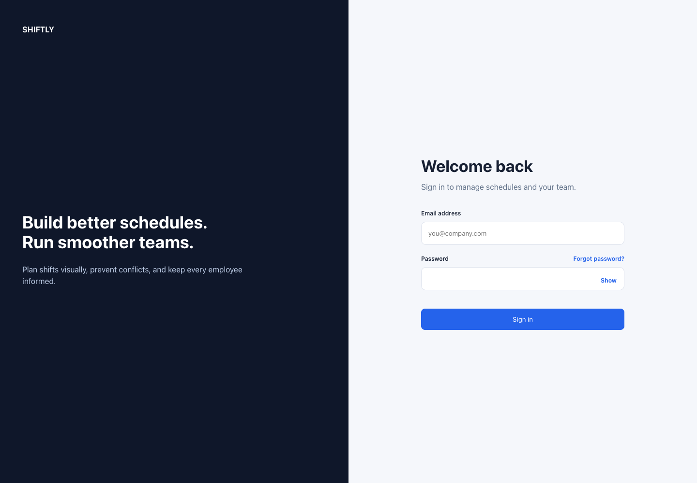

1. Open the Shiftly web address supplied by your organization.
2. Enter your work email address.
3. Enter your password.
4. Select **Sign in**.
5. If you cannot remember your password, select **Forgot password?** and follow the emailed reset link.

After sign-in, managers land on **Weekly Schedule**. Employees land on **My schedule**.

## 3. Understand the navigation

Use the left menu to move between work areas:

- **Schedule:** Build, review, and publish a weekly schedule.
- **Employees:** Add employees and maintain their work details.
- **Availability:** Record when employees can work.
- **Time off:** Submit and approve leave requests.
- **Operations:** Review swaps, attendance, and audit history.
- **Reports:** Review coverage, scheduled hours, overtime, and forecast cost.
- **Notifications:** Choose alerts and review delivery history.
- **Settings:** Maintain organization, positions, staffing, holidays, and user access.

Select **Log out** when you finish using a shared computer.

## 4. Add and maintain employees

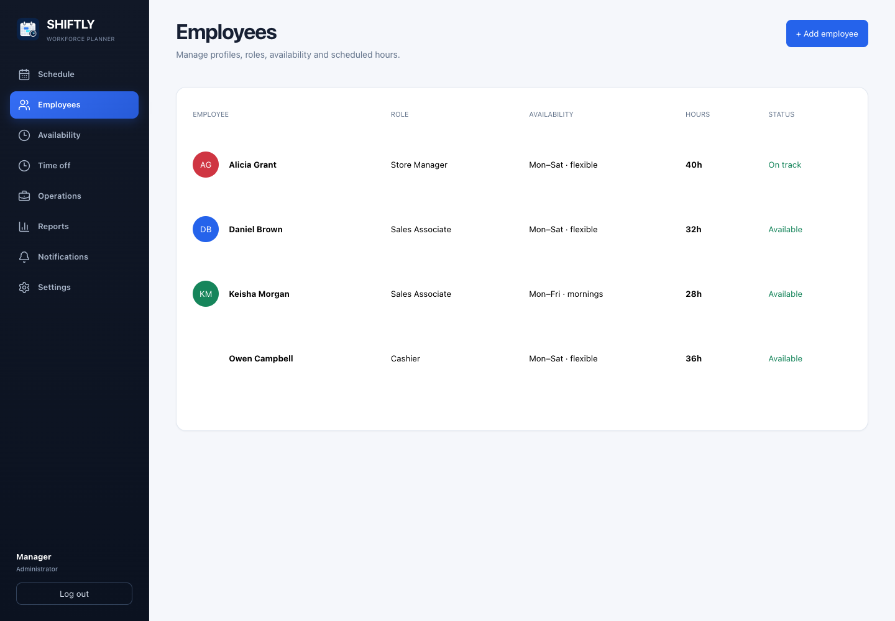

### Add an employee

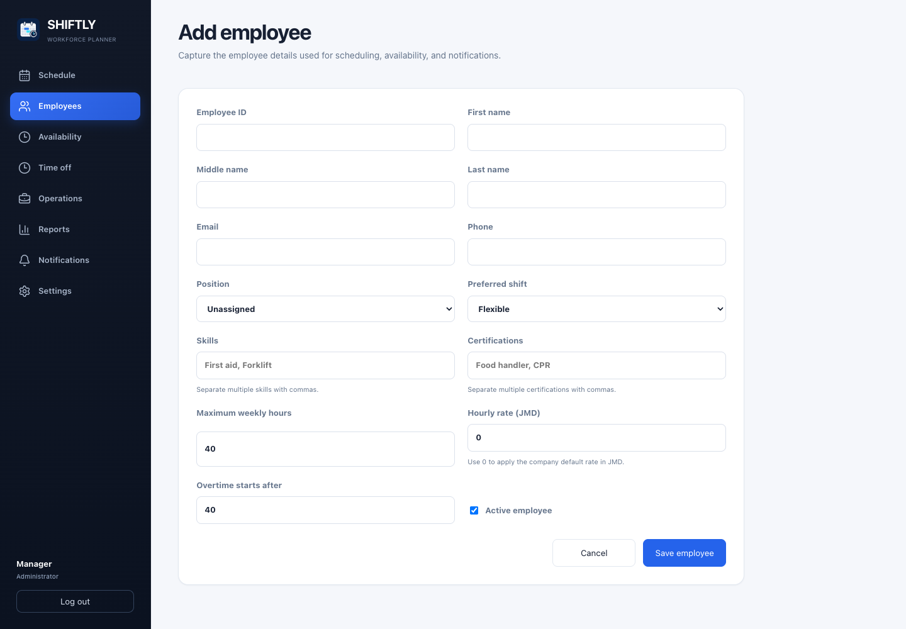

1. Select **Employees**.
2. Select **+ Add employee**.
3. Enter the employee ID, name, and contact details.
4. Choose a position and, if applicable, a preferred shift.
5. Add skills or certifications when they affect shift eligibility.
6. Enter maximum weekly hours, hourly rate, and overtime threshold.
7. Leave **Active** enabled for a current employee.
8. Select **Save employee**.

### Edit an employee

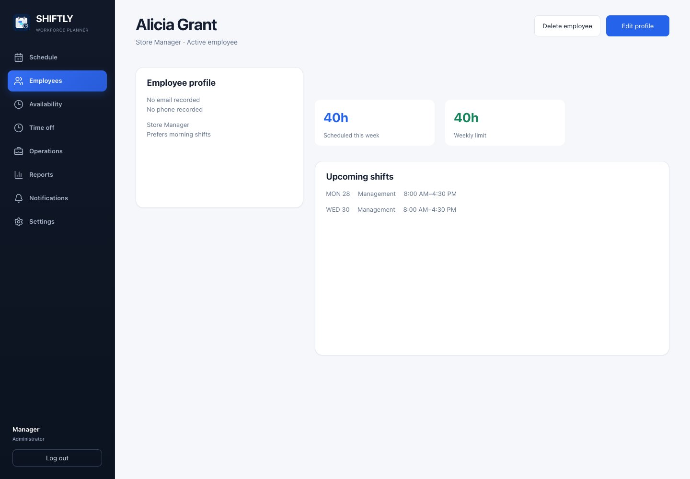

1. Select **Employees**.
2. Select the employee’s row.
3. Review the profile, weekly load, and upcoming shifts.
4. Select **Edit profile**.
5. Make the changes and save.

### Delete an employee

1. Select **Employees** and open the employee’s profile.
2. Select **Delete employee**.
3. Review the confirmation and confirm only if the employee should be removed.
4. After deletion, Shiftly returns to the employee directory.

Deletion removes the employee from the directory and prevents new shift assignments. Existing shifts and historical records are preserved. If deletion fails, the profile shows an error; check the message before trying again.

### Good practice

- Use a unique employee ID for every person.
- Assign the correct position before scheduling.
- Keep hourly rates and overtime thresholds current so report forecasts remain useful.
- Mark former employees inactive instead of reusing their record.

## 5. Record availability

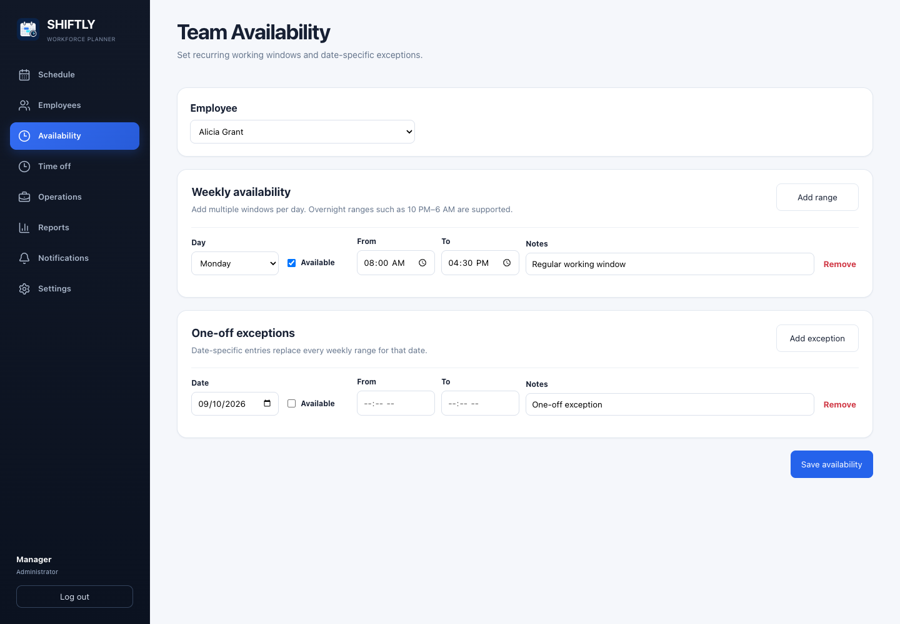

### Weekly availability

1. Select **Availability**.
2. Managers choose the employee; employees see their own availability.
3. Select **Add range**.
4. Choose the day and leave **Available** checked to enter **From** and **To** times.
5. Clear **Available** to mark the day unavailable; time fields are disabled for unavailable entries.
6. Add more ranges as needed.
7. Select **Save availability**.

You can add multiple windows per day, including overnight ranges such as 10 PM–6 AM. With no weekly restrictions, all times are treated as available.

### One-off exceptions

1. In **One-off exceptions**, select **Add exception**.
2. Choose the date.
3. Leave **Available** unchecked for an unavailable date, or check it and enter **From** and **To** times for an available window.
4. Add optional notes, then select **Save availability**.

Date-specific entries replace every weekly range for that date. Use **Remove** to delete an unwanted range or exception, then save. Use **Time off** for leave that requires approval.

## 6. Review time-off requests

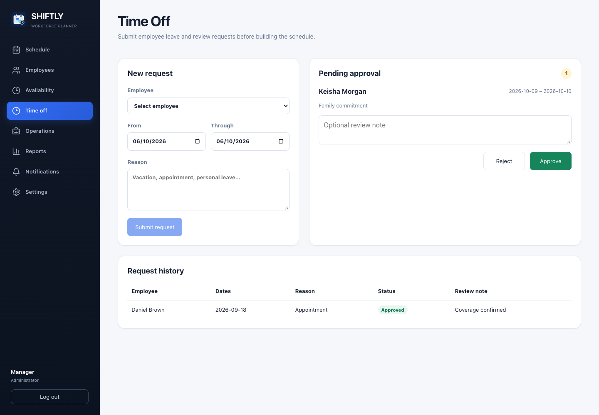

### Submit a request

1. Select **Time off**.
2. Managers choose an employee; employees submit for themselves.
3. Select the first and last date.
4. Enter a reason.
5. Select **Submit request**.

### Approve or reject a request

1. Open **Time off**.
2. Find the request under **Pending approval**.
3. Add an optional review note.
4. Select **Approve** or **Reject**.
5. Confirm the result in **Request history**.

Review time off before building or publishing the affected week.

## 7. Build the weekly schedule

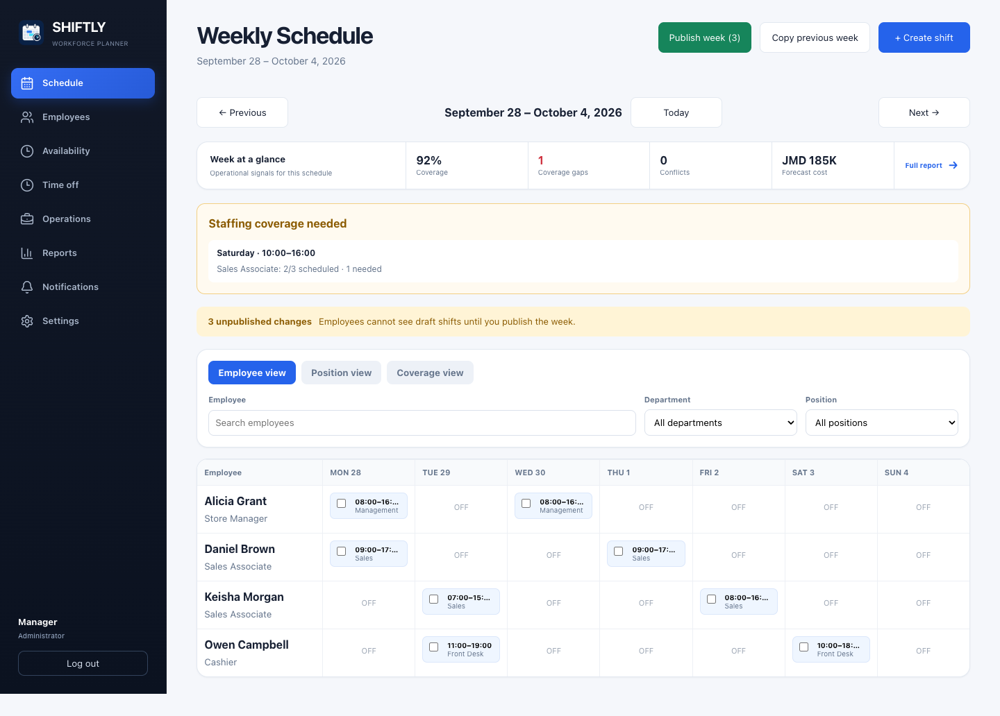

### Choose a week

1. Select **Schedule**.
2. Use **Previous** and **Next** to change weeks.
3. Select **Today** to return to the current week when viewing another week.

### Read the week-at-a-glance panel

Before editing, review:

- **Coverage:** percentage of staffing needs filled.
- **Coverage gaps:** periods below the staffing requirement.
- **Conflicts:** blocking assignment or labour-rule issues.
- **Forecast cost:** estimated regular and overtime labour cost.

### Create a shift

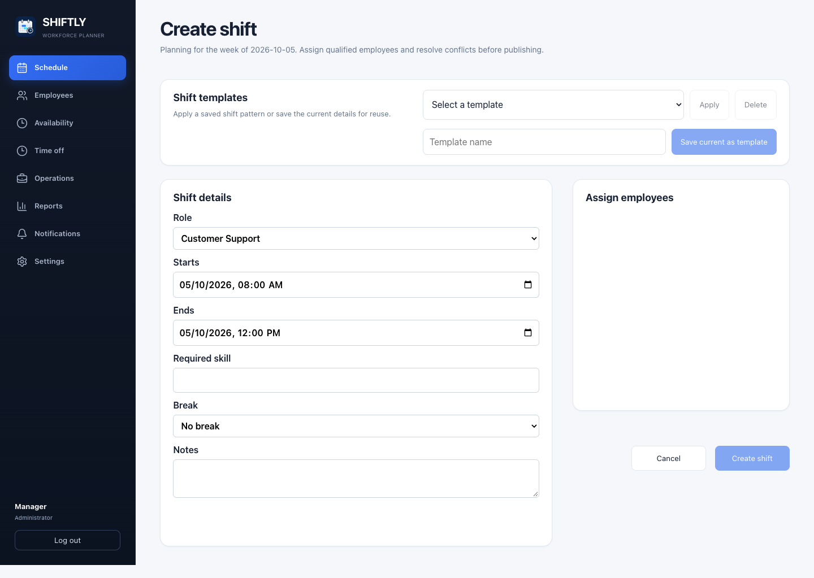

1. Select **+ Create shift**.
2. Choose the employee.
3. Set the date, start time, and end time.
4. Enter the role or department.
5. Set the break duration.
6. Add a required skill if applicable.
7. Review candidate warnings or conflicts.
8. Select **Create shift**. New shifts remain drafts until the week is published.

### Edit or cancel a shift

1. Select a shift card in the planner.
2. Update the assignment, time, role, skill, or break.
3. Save the change, or select the cancellation action if the shift should be removed.

### Copy a previous week

1. Open the target week.
2. Select **Copy previous week**.
3. Confirm the prompt.
4. Review copied drafts and any skipped conflicts.

### Use bulk actions

1. Select the checkboxes on one or more shift cards.
2. Use the bulk toolbar to update role, required skill, or break duration.
3. Use **Duplicate** when repeating selected shifts.
4. With one shift selected, choose an eligible employee and use **Fill open shift**.
5. Use **Undo** immediately if the last bulk change was incorrect.

### Check different schedule views

- **Employee view:** shows the week by employee.
- **Position view:** groups shifts by role or department.
- **Coverage view:** compares scheduled staffing against requirements by hour.

## 8. Publish a schedule

1. Resolve every item in **Schedule readiness**.
2. Review coverage warnings and time-off approvals.
3. Confirm shift times, roles, employees, and breaks.
4. Review the forecast labour cost.
5. Select **Publish week**.
6. Confirm that the status changes to **Week published**.

Draft shifts are hidden from employees. Publishing makes the current shifts visible in employee schedules and may trigger configured notifications.

## 9. Handle daily operations

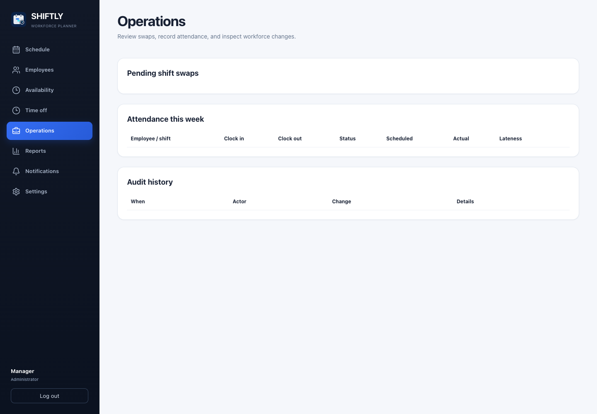

1. Select **Operations**.
2. Use the **Shift swaps** area to review employee swap requests.
3. Confirm that the proposed employee is eligible and does not create a conflict.
4. Approve or reject the request.
5. Use **Attendance** to record actual clock-in and clock-out times.
6. Use **Audit history** to review important scheduling and approval changes.

## 10. Review reports and export results

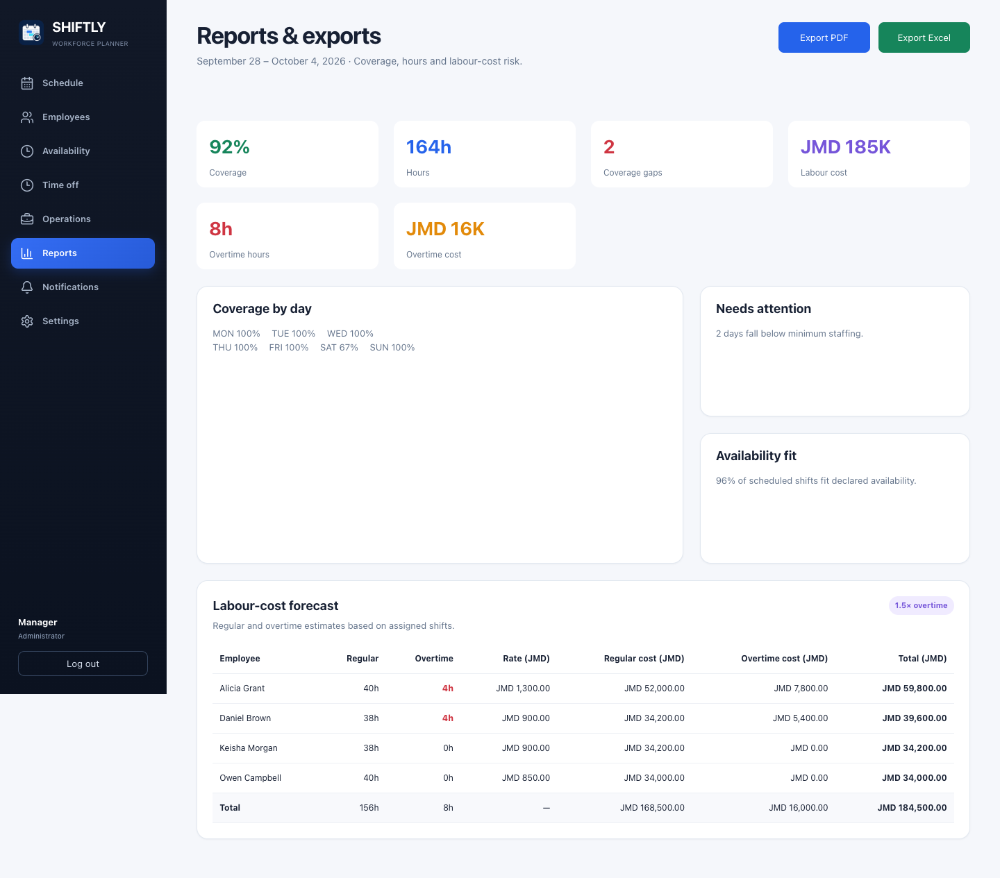

1. Select **Reports**.
2. Review coverage, total hours, coverage gaps, labour cost, overtime hours, and overtime cost.
3. Check **Needs attention** for under-staffed days.
4. Review **Availability fit** to identify assignments outside declared availability.
5. Review the employee-level labour-cost table.
6. Select **Export PDF** to open the browser’s print dialog, then choose a printer or save as PDF.
7. Select **Export Excel** to download the report as a spreadsheet-compatible CSV file.

## 11. Configure notifications

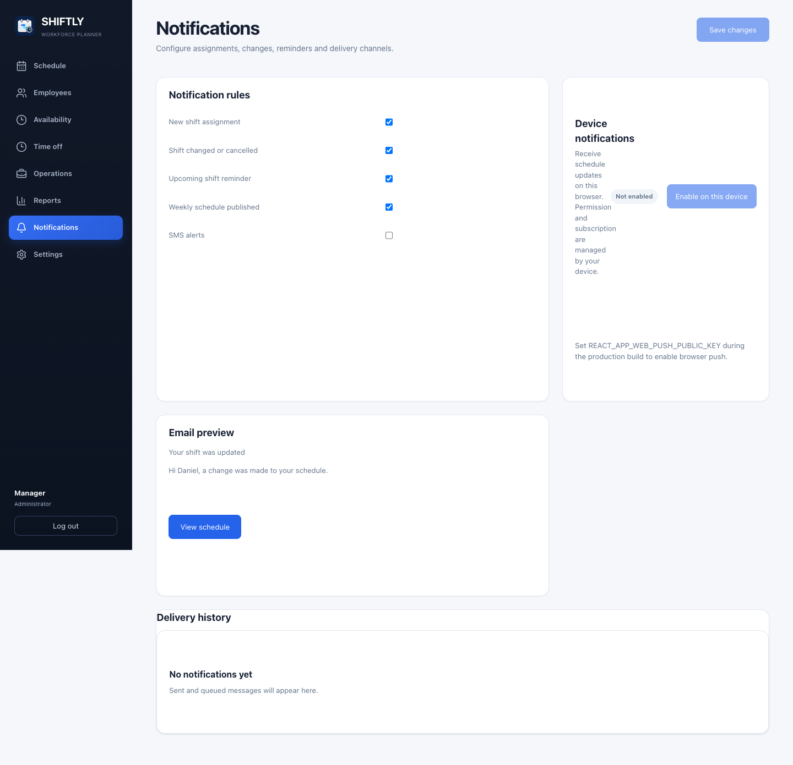

1. Select **Notifications**.
2. Choose which schedule and request updates should generate alerts.
3. Save the preferences.
4. To receive browser notifications, select the browser-push option and allow notifications when prompted.
5. Review delivery history if an expected message does not arrive.

Browser push requires permission and, outside local development, a secure HTTPS connection.

## 12. Employee quick start

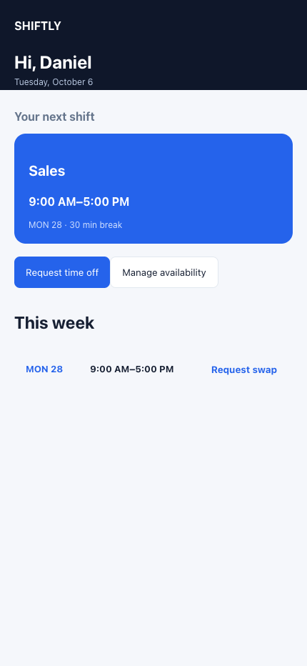

1. Sign in and open **My schedule**.
2. Review published shifts and shift details.
3. Open **Availability** to maintain recurring work times.
4. Open **Time off** to submit a dated leave request.
5. Open **Operations** to request an eligible shift swap.
6. Open **Notifications** to choose alerts.

If a manager says a shift was added but it is not visible, ask whether the week was published.

## 13. Administrator setup checklist

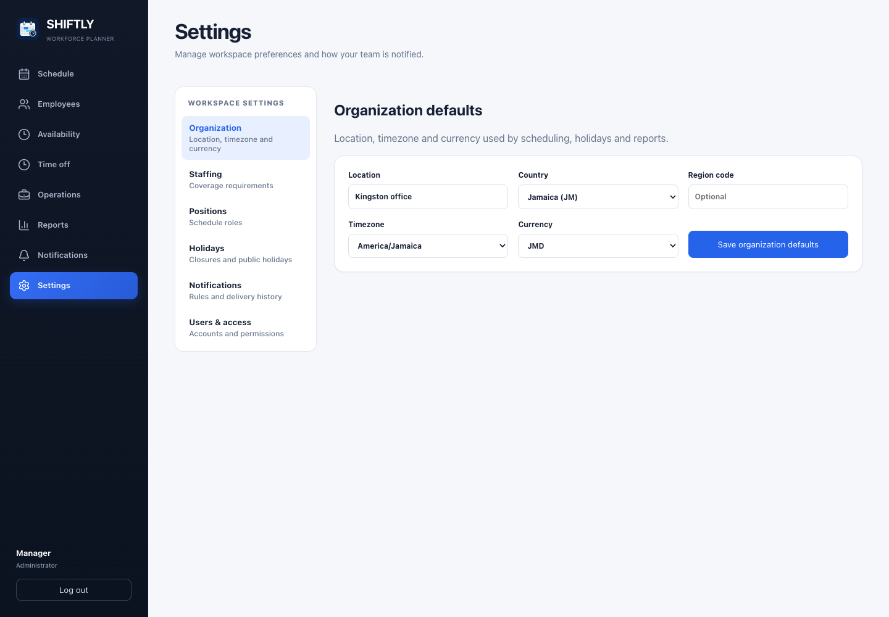

Complete these items before managers build the first live schedule:

1. In **Settings**, confirm the location, country, time zone, and currency.
2. Create the positions used by the organization.
3. Define minimum staffing requirements.
4. Import or add holidays and set their scheduling policy.
5. Create user accounts and assign the correct role.
6. Link each employee user account to the matching employee profile.
7. Add employee rates, limits, skills, certifications, and availability.
8. Test sign-in using one manager account and one employee account.

## 14. Troubleshooting

| Problem | What to do |
| --- | --- |
| Sign-in fails | Check the email and password. Use **Forgot password?** or contact an Administrator. |
| Access changed but the menu did not | Log out and sign in again to refresh the session. |
| Shift cannot be assigned | Review availability, overlapping shifts, time off, maximum hours, skills, and holiday rules. |
| Publish button is disabled | Resolve readiness conflicts and confirm there is at least one draft change. |
| Employee cannot see a new shift | Confirm the week was published and the employee is viewing the correct week. |
| Employee has no linked profile | Ask an Administrator to link the user account to the correct employee profile in **Settings**. Matching email addresses alone do not link accounts. |
| Employee disappeared from the directory | Ask a manager whether the profile was marked inactive or deleted. Deleted employees cannot receive new assignments; existing shifts and history remain. |
| Report does not match the planner | Refresh the page and confirm that schedule edits were saved. |
| Browser notifications do not work | Allow browser notifications, use HTTPS, and check notification preferences. |

## 15. Recommended demo video

Create one **6-minute manager workflow video** at 1080p, plus a separate **90-second employee quick-start video**. Short role-specific videos are easier to update and prevent employees from sitting through administrator-only setup.

Use the detailed recording script in [VIDEO-DEMO-SCRIPT.md](VIDEO-DEMO-SCRIPT.md).
